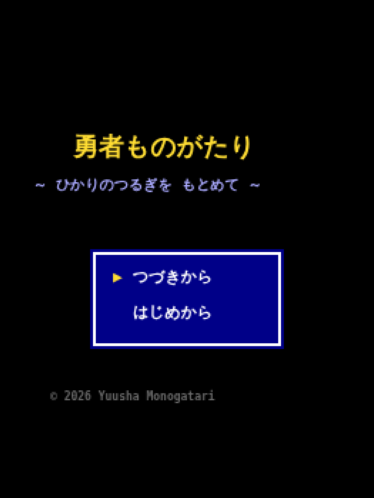
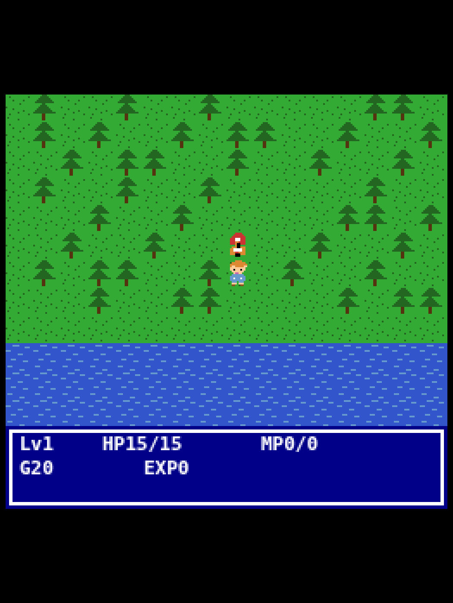
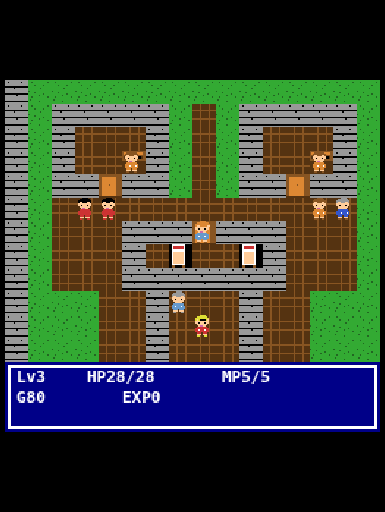
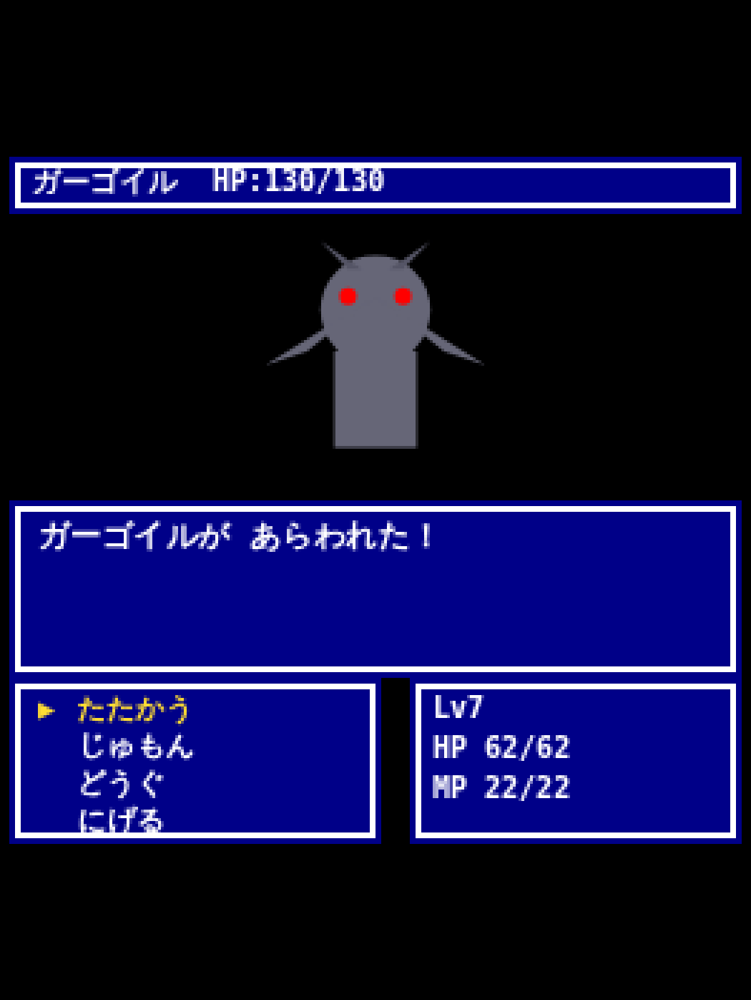
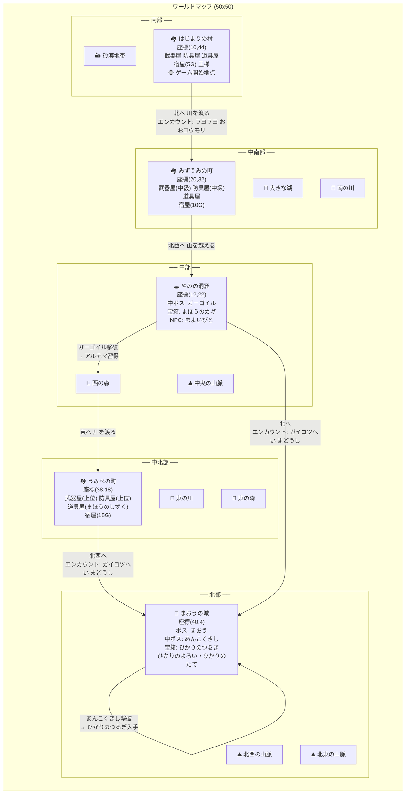
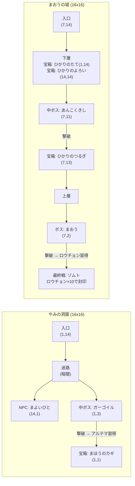
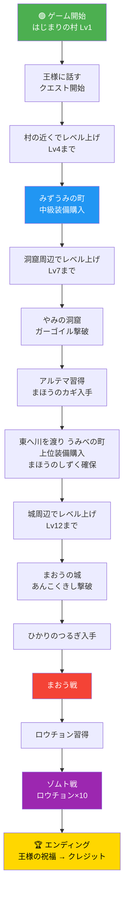

# 勇者ものがたり ～ひかりのつるぎを もとめて～

FC（ファミコン）風のターン制RPGです。  
ブラウザだけで動作し、PC・スマホの両方でプレイできます。

## スクリーンショット

| タイトル画面 | フィールド |
|:---:|:---:|
|  |  |

| 町 | 戦闘シーン |
|:---:|:---:|
|  |  |

---

## 遊び方

### 起動方法

`index.html` をブラウザで直接開くか、ローカルサーバーを起動してアクセスしてください。

```bash
cd /path/to/tale-of-yusha
python3 -m http.server 8080
# ブラウザで http://localhost:8080 を開く
```

### 操作方法

| 操作 | PC（キーボード） | スマホ（タッチ） |
|------|------------------|-------------------|
| 移動 | 矢印キー / WASD | 画面左下の十字ボタン |
| 決定・話す・調べる | Enter / Space / Z | Aボタン |
| メニュー・キャンセル | Escape / X / Backspace | Bボタン |

**スマホ対応**: タッチスクリーン端末では、画面下部に仮想コントローラー（十字キー＋A/Bボタン）が自動表示されます。PCのマウス付きブラウザでは非表示になります。

---

## ゲームの流れ

### 序盤 (Lv1～4)
1. **はじまりの村** で王様に話しかけると、クエストが始まる
2. 武器屋・防具屋・道具屋で装備とアイテムを買い、村の近くでレベル上げ
3. 村のNPC（むすめ、ちょうろう、へいし、おばあさん）と話すと、物語のヒントやレベル目安が得られる
4. Lv4くらいまで村の近くで戦うのが安全（プヨプヨ、おおコウモリ）

### 中盤前半 (Lv4～7)
5. 王様やNPCの助言どおり、まずは東の **みずうみの町** へ向かう（湖に囲まれた水辺の町）
6. みずうみの町で中級装備（てつのつるぎ、くさりかたびら）を購入
7. NPC（つりびと、はなうり、みずもりへいし、ものしりじいさん、こども）と話すと洞窟のレベル目安や世界の歴史が聞ける

### 中盤後半 (Lv7～10)
8. 北の山にある **やみの洞窟** に向かう（暗いのでたいまつ推奨）
9. 洞窟の奥で **中ボス（ガーゴイル）** を倒すと、最強呪文 **アルテマ** を習得
10. 洞窟の宝箱から **まほうのカギ** を入手

### 終盤前半 (Lv10～12)
11. 南東の **うみべの町**（港町）で上位装備を購入（この町でのみ **まほうのしずく**（MP回復）が買える）
12. NPC（へいし、みこ、せんちょう、さかなうり）から城のレベル目安やゾムト空間の伝承が聞ける

### 終盤後半 (Lv12～)
13. 北の **まおうの城** に向かう
14. 城の奥で **中ボス（あんこくきし）** を倒すと、奥の宝箱にアクセスできる
15. 宝箱から **ひかりのつるぎ**・**ひかりのよろい**・**ひかりのたて** を入手
16. **まおう** と戦闘 — 戦闘前に勇者の父についての因縁のセリフが入る

### 最終決戦
17. まおうを倒すと、まおうが「ひかりのつるぎさえなければ…」と悔しがり、闇の力で **ゾムト** を召喚する
18. 勇者は封印呪文 **ロウチョン** を自動習得し、連続で最終バトルへ突入
19. ゾムトには **通常攻撃や他の呪文は一切効かない** — **ロウチョンのみ有効**
20. ロウチョンを **10回** 唱えると、ゾムトは **ゾムト空間** に封印される
21. テキスト演出の後、はじまりの村に戻り王様から祝福を受ける
22. エンディングテーマが流れ、クレジット表示

> **注意**: まおう戦のHP/MPがそのまま引き継がれます。まおう戦でMPを温存し、まほうのしずくを持っておくことが重要です。

---

## システム

### バトル
- **1対1のターン制バトル**
- コマンド: たたかう / じゅもん / どうぐ / にげる
- ボス戦からは逃げられない

### レベル・呪文
- 最高レベル: **Lv20**
- 呪文一覧:

| 呪文 | MP | 習得 | 効果 |
|------|----|------|------|
| ヒール | 3 | Lv3 | HP30回復 |
| ファイア | 2 | Lv5 | 炎攻撃 |
| ワープ | 8 | Lv7 | 最後の町に帰還 |
| ヒーラ | 8 | Lv10 | HP80回復 |
| メガファイ | 5 | Lv13 | 強炎攻撃 |
| デグチ | 6 | Lv16 | ダンジョン脱出 |
| アルテマ | 15 | 洞窟中ボス撃破 | 最強攻撃魔法 |
| ロウチョン | 8 | まおう撃破 | ゾムト封印専用 |

### セーブ
- フィールドメニューから **いつでもセーブ可能**
- ブラウザの **localStorage** に保存されます
- 同じブラウザ・同じURLなら次回もロードできます
- ブラウザのデータ消去やシークレットモードではセーブが消えます

### メニュー
フィールドでBボタンを押すとメニューが開きます。
- つよさ / じゅもん / どうぐ / そうび / セーブ / **おと（ON/OFF）** / とじる / タイトル
- **おと**: BGMと効果音のON/OFFを切り替え。設定はlocalStorageに保存され、次回起動時も引き継がれます
- **タイトル**: 確認ダイアログ（はい/いいえ）が表示されます

### ショップ

**はじまりの村** (Lv1～)
- 武器屋: こんぼう / どうのつるぎ
- 防具屋: ぬののふく / かわのよろい / かわのたて
- 道具屋: やくそう / たいまつ / キメラのはね
- 宿屋: 5G

**みずうみの町** (Lv4～)
- 武器屋: どうのつるぎ / てつのつるぎ
- 防具屋: かわのよろい / くさりかたびら / てつのたて
- 道具屋: やくそう / じょうやくそう / たいまつ / キメラのはね
- 宿屋: 10G

**うみべの町** (Lv10～)
- 武器屋: てつのつるぎ / はがねのつるぎ
- 防具屋: くさりかたびら / てつのよろい / てつのたて / はがねのたて
- 道具屋: やくそう / じょうやくそう / **まほうのしずく** / たいまつ / キメラのはね
- 宿屋: 15G

---

## ワールドマップ



## ダンジョンマップ



## 冒険の流れ



## 物語のテーマ

- かつて「ひかりのおう」と呼ばれた王が闇の力に取り憑かれ、まおうとなった
- 勇者の父もかつて勇者であり、まおうとの戦いで命を落とした
- ゾムト空間とは、時間も空間もない永遠の牢獄。一度封印された闇は二度と戻れない
- NPCの会話は、ゲーム進行に応じて変化し、物語が徐々に解き明かされていく
- 各町の日常会話NPC（おばあさん、つりびと、こども、せんちょう等）が世界に深みを与える

### レベル目安

| 場所 | 推奨レベル | 出現敵 |
|------|------------|--------|
| 村の近く | Lv1～4 | プヨプヨ、おおコウモリ |
| みずうみの町周辺 | Lv4～7 | おおコウモリ、ゴブリン |
| やみの洞窟 | Lv7+ | おおコウモリ、ゴブリン、ガイコツへい、ガーゴイル |
| うみべの町周辺 | Lv10+ | ガイコツへい、まどうし |
| まおうの城 | Lv12+ | ガーゴイル、ゴーレム、あんこくきし |

---

## 技術情報

- **HTML5 Canvas + JavaScript（バニラ）** のみで構成
- 外部ライブラリ不要
- ファイル構成:
  - `index.html` — HTML・CSS・タッチコントローラー
  - `js/data.js` — ゲームデータ（マップ、モンスター、アイテム、NPC会話）
  - `js/game.js` — ゲームエンジン（描画、入力、バトル、メニュー）
- サウンド: Web Audio API による3声チップチューンBGM（7曲: タイトル / フィールド / 戦闘 / ボス戦 / 町 / ゾムト戦 / エンディング）+ 効果音
- メニューから音のON/OFF切り替え可能
- セーブ: localStorage

---

## デバッグ・テストコマンド

ブラウザの開発者ツール（F12）のコンソールから、各フェーズに直接ジャンプできます。  
適切なレベル・装備・アイテムが自動設定されます。

```
DEBUG.help()    // 全コマンド一覧を表示
```

### 町にワープ

| コマンド | 行き先 | Lv | 装備 |
|----------|--------|-----|------|
| `DEBUG.goStartTown()` | はじまりの村 | 3 | どうのつるぎ/かわのよろい/かわのたて |
| `DEBUG.goLakeTown()` | みずうみの町 | 5 | どうのつるぎ/かわのよろい/かわのたて |
| `DEBUG.goPortTown()` | うみべの町 | 10 | てつのつるぎ/くさりかたびら/てつのたて |

### ダンジョンにワープ

| コマンド | 行き先 | Lv | 備考 |
|----------|--------|-----|------|
| `DEBUG.goCave()` | やみの洞窟入口 | 7 | たいまつ付き |
| `DEBUG.goCaveBoss()` | 洞窟ボス手前 | 7 | ガーゴイルの目の前 |
| `DEBUG.goDarkCastle()` | まおうの城入口 | 14 | アルテマ習得済み |
| `DEBUG.goCastleMidBoss()` | 城中ボス手前 | 14 | あんこくきしの目の前 |

### ボス戦を直接開始

| コマンド | 対戦相手 | Lv | 装備 |
|----------|----------|-----|------|
| `DEBUG.fightCaveBoss()` | ガーゴイル | 7 | 中級装備 |
| `DEBUG.fightCastleMidBoss()` | あんこくきし | 14 | 上級装備+アルテマ |
| `DEBUG.fightDemonLord()` | まおう | 18 | ひかり装備一式 |
| `DEBUG.fightZomt()` | ゾムト | 18 | ひかり装備+ロウチョン |

### その他

| コマンド | 効果 |
|----------|------|
| `DEBUG.showEnding()` | エンディングを最初から表示 |
| `DEBUG.showEnding(3)` | 王様シーンから表示 |
| `DEBUG.showEnding(6)` | クレジットから表示 |
| `DEBUG.maxLevel()` | Lv20に設定（全呪文習得） |
| `DEBUG.maxGold()` | ゴールド9999に設定 |
| `DEBUG.fullHeal()` | HP/MP全回復 |
| `DEBUG.bestEquip()` | ひかり装備一式を装備 |
| `DEBUG.addItems()` | アイテムを補充 |
| `DEBUG.bestEquip()` | ひかり装備一式を装備 |
| `DEBUG.addItems()` | アイテムを補充 |

---

© 2026 勇者ものがたり
